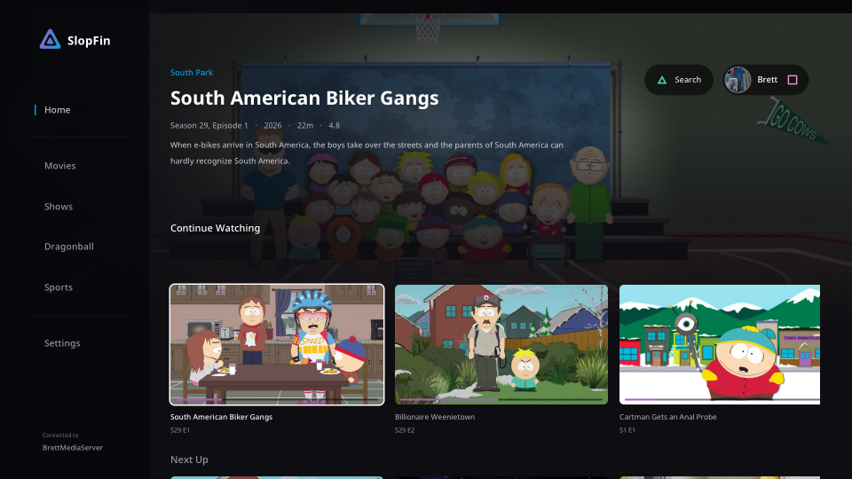

# SlopFin

**Jellyfin for your PlayStation 5, built around the DualSense.**

A native movie and TV client for **jailbroken PS5 consoles**, using the PS5's
H.264/HEVC hardware decoder. Firmware **8.20** is the tested setup.

[Downloads](https://github.com/BeLikeBrett/SlopFin/releases) ·
[Install](docs/GETTING_STARTED.md) · [Controls](docs/CONTROLS.md) ·
[Compatibility](docs/COMPATIBILITY.md) ·
[Report a bug](https://github.com/BeLikeBrett/SlopFin/issues/new/choose)

## PS5 features and controls

- **DualSense seeking:** L2/R2 tap one second, hold to scrub and press deeper to
  move faster. Adaptive triggers add resistance; switch feedback off in Settings.
  D-pad taps seek ten seconds; L1/R1 jump two minutes.
- **Skip Intro:** Square skips marked intros, with or without the timeline open.
  Jellyfin Intro segments or named chapters supply the timestamps.
  [Server setup](docs/INTRO_SKIPPING.md).
- **Per-series autoplay:** each show can override the global setting. Cross
  starts the offered next episode; Circle dismisses it while controls are hidden.
- **Profile and server dashboard:** crop avatars with D-pad and trigger zoom.
  Administrators can manage sessions, libraries and tasks from the controller.
  [Controls](docs/CONTROLS.md) · [Dashboard](docs/PROFILE_AND_DASHBOARD.md).

## What plays, and where it is decoded

**Jellyfin converts formats; SlopFin decodes them for playback.** Decoding turns
compressed video/audio into pictures/sound. Transcoding decodes **and re-encodes**
a stream into another format; that runs on your **Jellyfin server**, using its
CPU or GPU. SlopFin does not transcode video or audio into another streaming codec.

| Format / path | Who decodes it? | What reaches the display / speakers? | Evidence / limits |
| --- | --- | --- | --- |
| H.264, HEVC Main/Main10 video | PS5 **hardware** video decoder | Rendered video; SDR or HDR10 path | Console playback tested, including selected 4K sources. Rendering currently reduces to 1920-wide pictures. |
| AAC, MP3, AC-3 audio | PS5 **platform audio decoder** | 48 kHz PCM sound | Console decoder path; accepted rates/layouts only. Platform API does not establish whether each codec uses dedicated hardware. |
| E-AC-3, DTS core, TrueHD audio with PS5 decoding enabled | PS5 **CPU software** (FFmpeg) | 48 kHz, 16-bit PCM sound | Decoder fixtures and movie trials exercised. Atmos objects, DTS:X and full 24-bit output are not preserved. |
| AC-3, E-AC-3, DTS core with HDMI passthrough | **TV / AV receiver** | Compressed audio over HDMI | Native passthrough heard on the test TV (2026-09-15); packing matches FFmpeg. Other equipment/lip sync need checks. No TrueHD / DTS-HD / DTS:X passthrough. |
| Unsupported codec, rate, layout or selected quality | **Jellyfin server converts first**, then PS5 decodes the compatible result | Compatible stream; video can stay unchanged when only audio needs conversion | Negotiated before playback. A decoder failure during playback may require changing settings and retrying. |

Use **Settings → Audio & video** to toggle HDMI passthrough, PS5 software audio
decoding and Dolby Vision's HDR10-compatible fallback. No marker files or config
editing needed. TrueHD uses the CPU decoder when enabled and compatible;
passthrough takes priority for compatible DTS/E-AC-3. Changes apply on the next playback.

Native HDR10 **HDMI signalling and brightness** still need physical display
validation. Some Dolby Vision files have a tested HDR10-compatible base-layer
decode path; SlopFin does **not** output native Dolby Vision.
[Compatibility and settings](docs/COMPATIBILITY.md) ·
[What the playback stats mean](docs/PLAYBACK_STATS.md).

## Install

1. Download the **folder ZIP** from [Releases](https://github.com/BeLikeBrett/SlopFin/releases).
2. Transfer the complete `PPSA99001` folder to your homebrew loader's directory,
   commonly `/data/homebrew/`, and let the loader register it.
3. Open SlopFin, enter your Jellyfin server address, and sign in using Quick
   Connect or your username and password. `media.example.com` uses HTTPS;
   an explicit URL with a port or base path works too.

You need a jailbroken PS5 and your own Jellyfin server. The folder build is
recommended. **Native FPKG is experimental and currently fails to launch on
the test console during package mounting.**
[Setup details](docs/GETTING_STARTED.md) · [Help](docs/TROUBLESHOOTING.md)

Music, audiobooks, books/comics, photo libraries and live TV are not implemented. IPv6 and
self-signed HTTPS certificates are unsupported. Other firmware and output
devices need independent testing.

## Updates

**01.000.003** includes these settings, one-button intro skipping, circular avatar
cropping and **Settings → Updates**. Earlier public 01.000.000 installs need
one complete folder upgrade to obtain the updater. Later folder updates can be
checked and installed in the app with elfldr running. Console installation/restart
verification is still pending for this build; host archive and rollback tests pass.
[Update instructions and recovery](docs/UPDATES.md).

## Contribute

Start with [contributing](CONTRIBUTING.md) and the
[developer guide](docs/development/README.md) for builds, architecture,
playback internals and validation. Player instructions are in the
[help index](docs/README.md).

## License and credits

GPL-3.0-or-later. Built on the native-app boilerplate and ProsperoTV's
hardware-decode work. [NOTICE](NOTICE.md) records dependencies, fonts,
artwork and their licenses.

Unofficial; not affiliated with Jellyfin or Sony.
