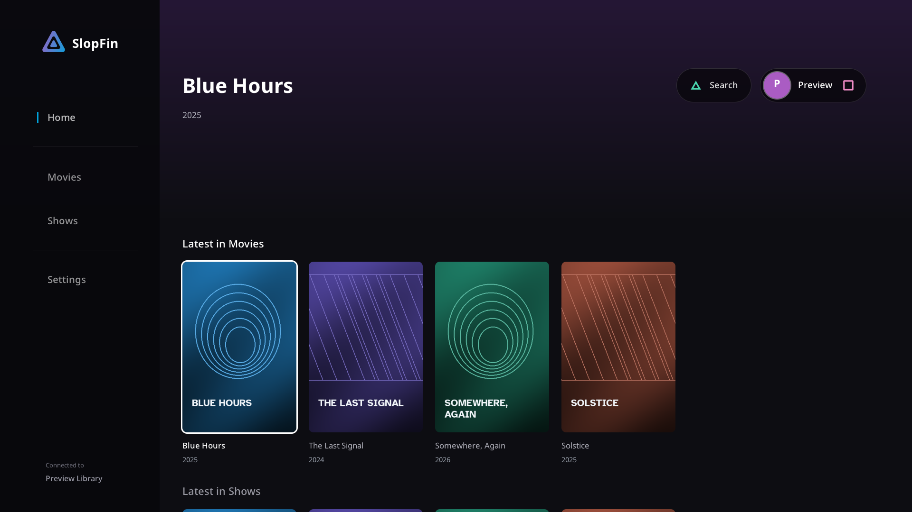

# SlopFin

**Your Jellyfin library, on PlayStation 5.**

An unofficial native client for **jailbroken PS5 consoles**, built around a
controller interface and the console's hardware video decoder.

[Download the preview](https://github.com/BeLikeBrett/SlopFin/releases/tag/01.000.000) ·
[Installation](docs/GETTING_STARTED.md) ·
[Compatibility](docs/COMPATIBILITY.md) ·
[Report a bug](https://github.com/BeLikeBrett/SlopFin/issues/new/choose)



*Actual Linux interface preview with fictional titles and original artwork.
It illustrates the interface; it does not demonstrate PS5 playback.*

## Choose your download

| Download | How it runs | Current status |
| --- | --- | --- |
| **[App folder ZIP](https://github.com/BeLikeBrett/SlopFin/releases/download/01.000.000/SlopFin-01.000.000-folder.zip)** | Extract and transfer the complete PPSA99001 folder to your homebrew loader | **Recommended.** Launch/playback tested on firmware 8.20 |
| **[Native FPKG](https://github.com/BeLikeBrett/SlopFin/releases/download/01.000.000/SlopFin-01.000.000-experimental.pkg)** | Install through a compatible PS5 package installer | **Experimental.** Contents verified and test installation passed; launch validation pending current kstuff/A53 support |

Both contain SlopFin. Native packaging makes distribution easier; it does not
change video quality or playback performance. Choose one method: both release
formats use PPSA99001. See [native package requirements](docs/NATIVE_FPKG.md).

## Made for the controller

- Browse movies and TV libraries from your own Jellyfin server.
- Search with separate **Movies**, **Series** and **Episodes** rows, so episode
  matches do not bury the show you are looking for.
- Enter addresses and credentials with the **PlayStation system keyboard**.
- Resume playback, switch audio/subtitles and continue to the next episode.
- **Skip Intro** when Jellyfin provides usable media segments or chapter markers.
- Adjust settings and use profile controls or the administrator dashboard.

## First launch

You need a compatible jailbroken PS5 environment, a Jellyfin server and an
account with access to movie or TV libraries. For the folder download:

1. Extract the ZIP. Transfer the **whole `PPSA99001` folder** into the homebrew
   directory used by your loader, commonly `/data/homebrew/`.
2. Let the loader register the title, then launch **SlopFin** from the PS5 menu.
3. Enter your server address and choose Continue. A hostname such as
   `media.example.com` defaults to HTTPS; `https://media.example.com` works too.
   A bare LAN address such as `192.168.1.20` uses Jellyfin's HTTP port 8096.
4. Sign in with Quick Connect or your username and password.

No bundled account, developer server or reporting service is required. Saved
settings and sign-in stay on your console. Reports are local unless you
explicitly configure a receiver and choose to send one.

The [setup guide](docs/GETTING_STARTED.md) covers loader requirements, server
base paths, HTTPS behavior and building from source. For intro detection setup,
read [intro skipping](docs/INTRO_SKIPPING.md).

## What to expect

This is an early public preview. Firmware **8.20** is the main console test
environment; other firmware, loaders, servers and displays need independent
testing. H.264/HEVC playback works on tested files. Native HDR10 and HDMI
compressed audio remain experimental. The preview downloads include the
optional software-audio decoder; server fallback is still available.

Music albums, audiobooks, photos and live TV are not implemented. Self-signed
HTTPS certificates and IPv6 server addresses are not supported. The
[compatibility table](docs/COMPATIBILITY.md) separates implemented behavior
from tested hardware results and remaining limits.

## Build and contribute

```sh
git clone https://github.com/BeLikeBrett/SlopFin.git
cd SlopFin
make doctor
make test
make host
make PS5_CLANG=/usr/bin/clang
```

The build downloads pinned public dependencies; no proprietary publishing SDK
is required. `make host` previews the interface on Linux without video decoding
or a replacement for the PlayStation keyboard. See [Linux preview](docs/HOST_BUILD.md).
For optional software audio and native packages, follow the
[build guide](docs/GETTING_STARTED.md) and [package guide](docs/NATIVE_FPKG.md).

Read [contributing](CONTRIBUTING.md), [architecture](ARCHITECTURE.md) and
[testing](docs/TESTING.md). Bug reports should include firmware, loader,
Jellyfin version and relevant media details; redact credentials and private
addresses from logs. The [documentation index](docs/README.md) links the
technical references and dated validation history.

## License and credits

GPL-3.0-or-later. SlopFin builds on the native-app boilerplate and ProsperoTV
hardware-decode work. Attribution, public SDK dependencies, fonts, artwork and
linked-library licenses are recorded in [NOTICE.md](NOTICE.md).

SlopFin is not affiliated with Jellyfin or Sony.
