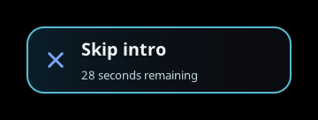

# Skip Intro

SlopFin shows **Skip intro** while playback is inside an episode's detected
intro. It seeks to that intro's end, so cold opens and different intro lengths
can be handled without a fixed-duration skip.

- **Cross** skips with the normal playback controls hidden.
- **Square** skips when those controls are visible; Cross keeps its normal role.
- **Circle** dismisses the prompt when the normal controls are hidden.

A failed seek keeps the button available for another attempt. Open audio,
subtitle or quality panels temporarily hide it.

## Set up your server

The server needs usable intro timestamps. Jellyfin's
[media segments](https://jellyfin.org/docs/general/server/metadata/media-segments/)
are generated by providers and made available to clients.

Install a compatible segment provider, such as
[Intro Skipper](https://github.com/intro-skipper/intro-skipper), and run its
analysis/segment-scan task. Keep automatic scanning enabled for new episodes.
Reopen the episode in SlopFin after new markers are generated.

SlopFin checks Jellyfin Intro segments first. If none are available, it accepts
explicitly named Intro/Opening/Opening Credits/Opening Theme/Title Sequence or
OP chapters, using the next chapter as the end. Generic first chapters, recaps,
missing end times and implausible ranges do not become intro buttons.

Changing or unique intros can lack markers. If an episode has no usable range,
there is no skip button. Installing SlopFin does not analyze episode audio.

## Checked episodes

Console checks passed on South Park S1E1 and The Office S2E3, including the
controls-visible skip action. This demonstrates the client path; it does not
guarantee markers for every episode on another server.
