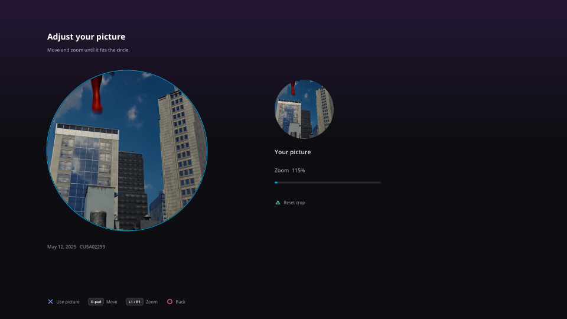

# Profile, dashboard and the detail pages

Updated 2026-10-03. Current profile controls and dated console validation.

## Series pages and detail pages

- **Next Up per series.** A show's page asks `/Shows/NextUp?seriesId=` and shows
  that episode as a 480×270 card in the top right of the hero. It never takes
  the D-pad's focus, which stays on the seasons and the cast: **Triangle** plays
  it from where it was left and **Square** opens the episode, from anywhere on
  the page, with both prompts under the card (Brett's choice). Playing fetches
  the full record first through the next-episode path (`Request::play_sibling`).
  Triangle play verified on the console with FROM S4:E3.
- **The page fills the screen.** The hero sits 90 pixels higher and carries
  runtime and "Ends at", genres, director, writer and studios, and the tagline.
  Under it: the season strip (a show), the rest of the season with the current
  episode marked "Viewing" (an episode), and Cast & Crew with 180-pixel photos,
  which is centred in the remaining space on a film. The page scrolls with the
  focus. Console draw time: 7.5 ms at rest and 8.9 ms scrolling on a film, 6.0 ms
  on a show, at 4K.
- **Removed at Brett's request:** More Like This, and the Audio/Subtitles line.

## Profile badge and menu

- On Home and library pages only, top right, beside a Search chip of the same
  height (72 px) on the page title's line. Settings and the Dashboard do not
  show it; Settings → Account leads to the same places.
- **Square** opens the menu: Profile, Dashboard (administrators), Sign Out.
  The choices are pills that drop in one after another, centred under the badge
  and a little narrower than it; focus uses a dark surface and cyan outline.
- Lists share dark surfaces, cyan outlines and smooth focus transitions
  (`ui::focus_pill`). Label alignment uses visible glyph bounds.

## Profile screen

- **Change picture** opens a picker over the console's own captures
  (`/user/av_contents/photo`, JPEG and PNG) and USB drives. The console gives
  applications no photo-picker dialog, so SlopFin reads the files itself.
- **The app sandbox hides those folders** (`open` fails with ENOENT). Opening the
  picker sends `assets/slopfin-sandbox.bin` to elfldr on 127.0.0.1:9021; it points
  SlopFin's root and jail directories at the real root vnode. Built from
  `payloads/sandbox/` by `make`. Directory listing uses `sceKernelGetdents` with a
  64 KiB buffer (the gallery's filesystem refuses 8 KiB with EINVAL).
- Select a picture to open **Adjust your picture**, with a large circular
  crop and matching avatar preview. Move with the D-pad, zoom with L1/R1 or
  the triggers, reset with Triangle, save with Cross or return with Circle.
  The crop stays within the image bounds.
- The selected region is resized to at most 512×512 and encoded as JPEG
  (`vendor/stb_image_write.h`); image buffers use flexible memory. Upload is
  `POST /UserImage?userId=` with a **base64** body. The earlier upload path was
  console-tested with the original restored afterwards. The new editor
  was console-tested through movement, zoom, reset and cancel; synthetic host
  tests verify the exported JPEG without changing a production avatar.
- **Change password** asks the system keyboard for the current, new and repeated
  password and posts `/Users/Password?userId=` with `CurrentPw`/`NewPw`. **Not
  run against the server**: a wrong current password counts as a failed sign-in.
- **Remove picture** is `DELETE /UserImage`. Not run.

## Dashboard

Pages: Overview (server, counts, active devices, latest activity), Activity,
Devices, Libraries, Users, Scheduled tasks, Playback (encoding settings), General
(system settings), Logs (the last 96 KiB of a log, streamed), Plugins. Every
page's data was loaded from brettserver in the Linux preview.

Rows with actions open a list of them; destructive ones confirm first:
scan all or one library, restart or shut down the server, stop, pause or message
a session, remove a device, enable/disable a user or change administrator
rights, run or stop a task, save settings. The settings pages post back the
whole document the server sent, edited in place, so unshown fields survive.

**None of the actions was run** against Brett's server, and no keyboard-driven
field was edited on the console. Endpoints were checked against the server's
own OpenAPI document (10.11.10), not memory: the activity log is
`/System/ActivityLog/Entries`, pictures are `/UserImage`, passwords
`/Users/Password`.

## Files

`src/account.cpp` (badge, menu, Profile, picker), `src/dashboard.cpp`,
`src/background.cpp` (one worker thread for both), `src/ui_common.cpp` (layout
constants, chips, focus pill), `payloads/sandbox/`. Host preview: `open <itemId>`
in a capture script opens a detail page; `open:<itemId>` does the same through
`/data/slopfin-input` on the console.

## Version bar (Opus 5, 2026-09-15)

A movie or episode with more than one file gets a **Version** row above its
buttons: one pill per version (its quality -- 4K, 1080p -- or the file's own
name when two share a quality), the chosen one lit, and the chosen file's
picture, sound and size after them. Up from the buttons focuses it, left and
right choose, down or Cross returns to Play. The format badges at the top, the
Details sheet and Play/Start from beginning all use the chosen version. It
replaced a version button in the button row, which Brett found unclear.
Quality labels count width as well as height, so scope crops (3840x1600,
1920x800) read 4K and 1080p.

## Dashboard: what an administrator can actually do (Opus 5, 2026-09-15)

Every page reads live from the server; actions run against it, and anything
that changes something asks first with Cancel focused.

| Page | Actions |
| --- | --- |
| Overview | Scan all libraries, restart the server, shut it down |
| Devices | Remove a device |
| Sessions (Overview) | Pause/resume, stop playback, send a message |
| Libraries | Scan a library, replace all metadata and artwork |
| Users | Disable/enable, grant/remove administrator, remote access, downloads, Live TV, playback, reset the password, delete the user; and "sign every device out" |
| Scheduled tasks | Run now, stop a running task |
| Playback / General | Edit the server's settings and save them back |
| Logs | View the end of a log, or send it to the report server |
| Plugins | Enable, disable, uninstall |

The user switches are single policy flags: the user's whole policy is read,
one flag is changed, and the policy goes back, so nothing else about them is
touched. Verified on the console against Brett's server by opening each menu
(nothing was run against it).

Reports and logs both land in the same place -- see
[diagnostics](DIAGNOSTICS.md).

## One-way actions are held, not pressed (Brett, 2026-09-16)

X opens a row's menu and X runs the highlighted item, so two quick presses used
to be able to reach a confirmation nobody meant to open. Anything that cannot
be undone -- delete a user, reset a password, sign every device out, replace a
library's metadata, remove a device, uninstall a plugin, restart or shut down
the server -- is now marked apart:

- it sits below a rule at the foot of the menu, in red;
- choosing it always asks, with **Cancel** focused;
- and the confirmation only goes ahead while **Cross is held for a second**, a
  bar filling under the button as it counts.

Settings -> Diagnostics -> "Delete the reports" is held the same way.

Proved on the console by holding a harmless action flagged the same way
(`dashboard: Hold check (reads the server name) ok`); a press alone does
nothing. `tools/press.sh "hold:cross:90"` is how the tooling holds a button,
added for exactly this.
